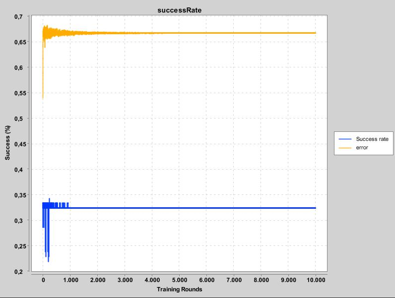
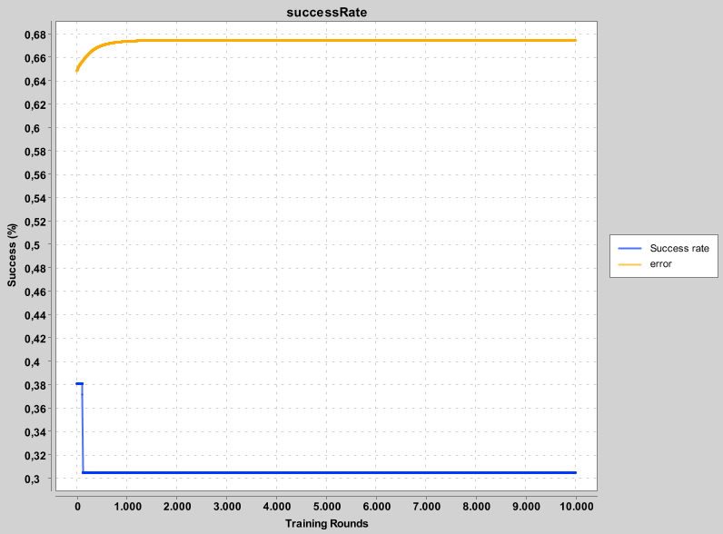
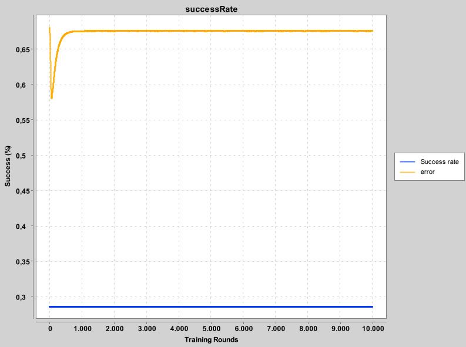
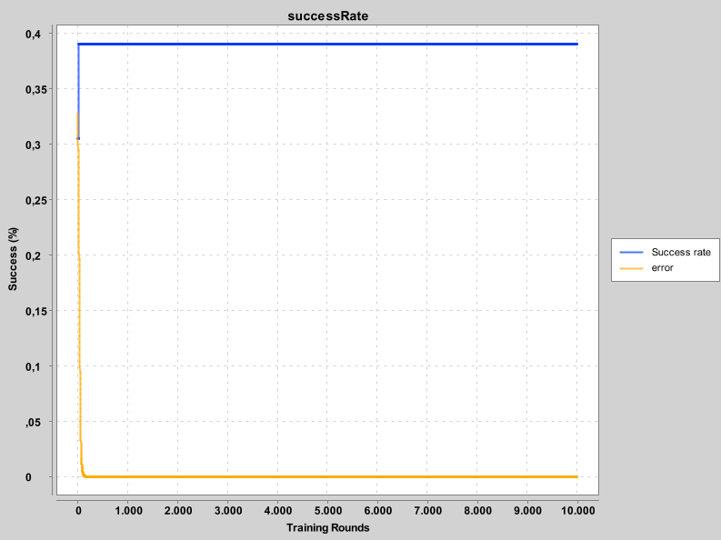

# Tarea 1

## Agregar XChart para correr la tarea
Para correr la tarea se debe agregar XChar a las librerías externas, esto se puede 
realizar en File -> Project Structure (ctrl + alt + mayús + s),
donde haciendo click en el icono `+` puede agregar el `.jar`, puede descargar
Xcart desde https://knowm.org/open-source/XChart/.

Además se debe tener google-java-format.xml el cual viene incluido en el proyecto
sin el cual XChar no corre

## Correr el proyecto
Para esto debe ir a la carpeta Assignment1, y correr la función
`main()` en `Homework.kt` si usa intlliJ, dado que Kotlin viene incluido,
para instrucciones en otros IDE o para linea de comandos revisar https://kotlinlang.org

# Sobre la tarea

## Advertencia
Acabo de notar que el label del eje y tiene un %, es un valor absoluto donde 1 es 100%
no es un porcentaje

## Análisis

Lamentablemente a la red le cuesta bastante aprender con valores
entre 0 y 1, e incluso si consideramos numeros más grandes (para hacer
más sensible a la red) tanto en pesos como en la normalización 
la red se queda estancada muy rapidamente, lamentablemente no he
podido descubrir la causa del error, ya que a mi parecer la propagación de
errores y actualizacion de pesos está bien implementada (como algoritmo)
con cambios discretos y pequeños cada vez que se comete un error.

 
En la imagen anterior podemos apreciar como el error varía, considerando una
tasa de aprendizaje de 0.1, en resultado2.png vemos una tasa de aprendizaje
de 0.001. Curiosamente en este es evidente que el error aumenta, por lo
cual no se descarta que la implementación de tanto la propagación de errores
como de la actualización de pesos estén malas.

(Para las dos imagenes anteriores de usaron 6 capas internas, 3 de 3 neuronas y 3 de 4 neuronas)

Si se usan 6 capas de 10 neuronas se nota una curva bastante interesante en el error, que se puede
apreciar en resultado3.png.

Se realiza un análisis donde se nota que no se calculó el error cuadrático, al arreglarlo se produce
el efecto mostrado en resultado4.png, lo cual significa una mejora significativa al disminuir el error
y amentar los aciertos, no a un punto deseable pero a algo bastante mejor.

